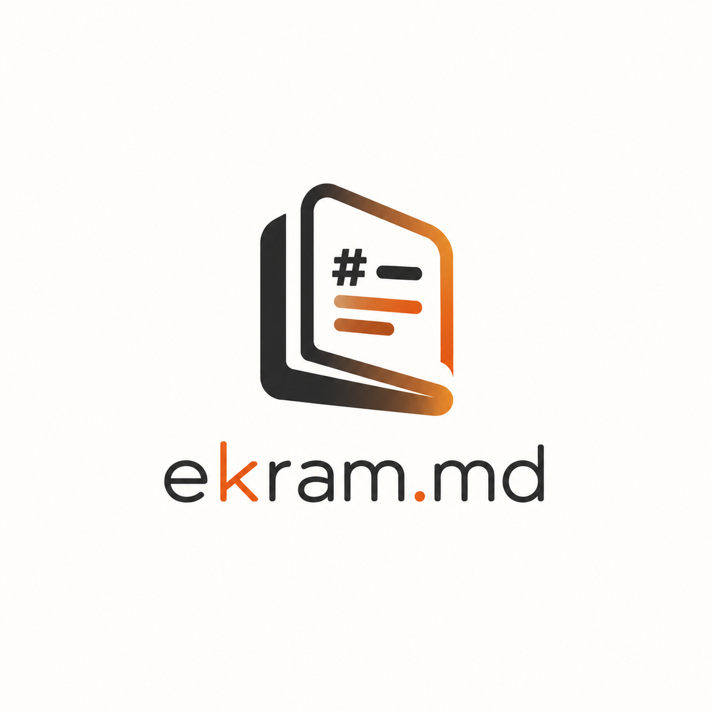

<p align="center"></p>

# ekram.md

A fast WYSIWYG markdown editor for Windows.

Markdown renders as you type, on one editing surface: there is no split pane and
no preview to keep in sync. Headings, lists, tables, math and code blocks take
shape as you write them, and your files stay plain markdown, written back
exactly as they came.

## Features

- **Write in place.** Headings, lists, task lists, tables, code blocks with
  syntax highlighting, math, mermaid diagrams, GitHub alerts, footnotes, front
  matter and a `[TOC]` all render as you type. `Ctrl+/` shows the raw markdown
  and back.
- **Your files, untouched.** A file is written only when you save it, byte for
  byte as it came: encoding, BOM and line endings are kept. A file that could not
  be written back faithfully is flagged the moment it opens, before you type.
- **Never lose work.** Unsaved changes are kept as you type and offered back
  after a crash, and the last twenty versions of every file can be restored from
  **Help ▸ Data Recovery**. Automatic saving is there if you want it.
- **Folders of notes.** Open a folder for its file tree, outline and full-text
  search, with replace across every file after a preview. Link notes with
  `[[wiki links]]`, suggested as you type.
- **Find anything.** Find and replace with regular expressions, a command
  palette (`Ctrl+Shift+P`) and Open Quickly (`Ctrl+P`).
- **Make it yours.** Ten themes, or your own; text size, column width, fonts and
  line height; focus and typewriter modes.
- **Share it.** Export to self-contained HTML or to PDF, or print, styled as you
  see it on screen.
- **Keyboard all the way.** Most commands have a shortcut, `Alt` opens the
  menus, and **Help ▸ More Topics** lists every shortcut.

## Install

Requires Windows 10 or 11, 64-bit.

1. Download `ekram.md-Setup-<version>.exe` from the
   [latest release](https://github.com/m-ekram/md-reader/releases/latest).
2. Run it. Windows may show **"Windows protected your PC"** (SmartScreen),
   because the installer is not yet code-signed. Click **More info**, then
   **Run anyway**.
3. Choose where to install it. No administrator rights are needed: it installs
   for your account only.

The installer adds ekram.md to the Start Menu and the desktop, and opens `.md`
and `.markdown` files with it: double-click one to open it, or, with ekram.md
already running, to open it in a new tab. Uninstall it from **Settings ▸ Apps**;
your settings stay, in case you install it again.

**Portable:** download `ekram.md-<version>-win-x64.zip` instead, unzip it
anywhere, and run `ekram-md.exe`. The portable copy does not update itself; it
tells you when a new version is out.

### Updates

The installed app checks GitHub for a newer version a few seconds after it
starts. If there is one, it says so and asks; nothing is downloaded unless you
choose **Download**, and the app never restarts on its own: choose **Restart
now**, or the update is installed the next time you quit. **Help ▸ Check
Updates** checks at any time, and **Preferences ▸ Files** turns the automatic
check off.

## Privacy

ekram.md has no telemetry, no analytics and no account. Your files stay on your
computer: nothing you write is sent anywhere.

The app reaches the network only to check GitHub for updates, which you can turn
off, and to open a link you click, in your browser. Spell checking is done by
Windows, on your computer. Images on the web that a document points to are not
loaded. Diagnostics are written to a log file in your profile folder
(`%APPDATA%\ekram.md\logs`) and never leave it.

## Build from source

```powershell
git clone https://github.com/m-ekram/md-reader.git
cd md-reader
npm install
npm run dev        # run it
npm run build:win  # the installer and the portable zip, into dist/
```

Node 24 is needed. [DEVELOPMENT.md](DEVELOPMENT.md) covers the tests, the
release process and how the app is put together.

## Licence

[MIT](LICENSE) © 2026 Muhammad Ekram.

Built on [Electron](https://www.electronjs.org/),
[Milkdown](https://milkdown.dev/) and [ProseMirror](https://prosemirror.net/);
**Help ▸ Credits** lists every library it uses.
