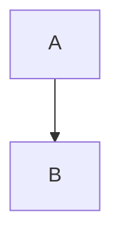

# Markdown Reference

Everything shown here is saved back as you wrote it, with a few exceptions
that a save rewrites into an equivalent form:

- tables: the delimiter row and cell padding are normalised (the content and
  the alignment are kept)
- reference links (`[text][label]`) become inline links
- a line break made with two trailing spaces becomes a backslash
- HTML entities such as `&amp;` become the characters they stand for
- underlined headings (`Title` over `=====`) become `#` headings
- indented code blocks become fenced ones
- a bare `*` or `_` is escaped

When a file you open contains any of these, the status bar says which ones,
and where the first change would be, before you edit anything.

## Text

```
**bold**  _italic_  ~~strikethrough~~  `code`  <u>underline</u>
```

## Headings

```
# Heading 1
## Heading 2
###### Heading 6
```

`Ctrl+1` through `Ctrl+6` apply a level; `Ctrl+0` returns to a paragraph.

## Lists

```
- a bullet
1. a number
- [ ] a task
- [x] a completed task
```

`Tab` and `Shift+Tab` indent and outdent inside a list.

## Quotes and alerts

```
> an ordinary quote

> [!NOTE]
> A note, rendered with its own colour and label.
```

The alert kinds are `NOTE`, `TIP`, `IMPORTANT`, `WARNING` and `CAUTION`.

## Code

````
```js
const answer = 42
```
````

The language sets the highlighting. `Paragraph ▸ Code Tools` copies the block or
changes its language.

## Tables

```
| Column | Another |
| --- | ---: |
| left | right |
```

`Alt+Up` and `Alt+Down` move the current row.

## Links, images and footnotes

```
[a link](https://example.com)
[[Another note]], [[Another note#A heading|shown as this]]

A claim.[^1]

[^1]: The supporting detail.
```

## Math and diagrams

```
Inline math: $e^{i\pi} + 1 = 0$
```

````

````

## Front matter

```
---
title: A document
tags: [notes]
---
```

`Paragraph ▸ YAML Front Matter` adds or removes the block.

## Not supported

**Reference links** (`[text][label]` with a separate definition) are read
correctly but saved as inline links. **Block math** (`$$…$$` on its own lines)
is read and saved unchanged, but cannot be created from the menus. The menu
items for both are greyed rather than offering something that would not behave
as expected.
