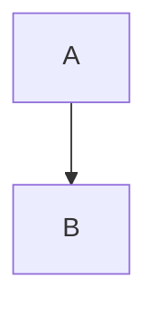

# Markdown Reference

Everything here round-trips: open a file containing it, save, and the file is
unchanged.

## Text

```
**bold**  _italic_  ~~strikethrough~~  `code`  <u>underline</u>
```

## Headings

```
# Heading 1
## Heading 2
###### Heading 6
```

`Ctrl+1` through `Ctrl+6` apply a level; `Ctrl+0` returns to a paragraph.

## Lists

```
- a bullet
1. a number
- [ ] a task
- [x] a completed task
```

`Tab` and `Shift+Tab` indent and outdent inside a list.

## Quotes and alerts

```
> an ordinary quote

> [!NOTE]
> A note, rendered with its own colour and label.
```

The alert kinds are `NOTE`, `TIP`, `IMPORTANT`, `WARNING` and `CAUTION`.

## Code

````
```js
const answer = 42
```
````

The language sets the highlighting. `Paragraph ▸ Code Tools` copies the block or
changes its language.

## Tables

```
| Column | Another |
| --- | ---: |
| left | right |
```

`Alt+Up` and `Alt+Down` move the current row.

## Links, images and footnotes

```
[a link](https://example.com)

A claim.[^1]

[^1]: The supporting detail.
```

## Math and diagrams

```
Inline math: $e^{i\pi} + 1 = 0$
```

````

````

## Front matter

```
---
title: A document
tags: [notes]
---
```

`Paragraph ▸ YAML Front Matter` adds or removes the block.

## Not supported

**Reference links** (`[text][label]` with a separate definition) and **block
math** (`$$…$$` on its own lines) are read correctly but are not modelled
separately, so saving rewrites them: a reference link becomes an inline link.
The menu items that would create them are greyed rather than offering something
the next save would undo.
